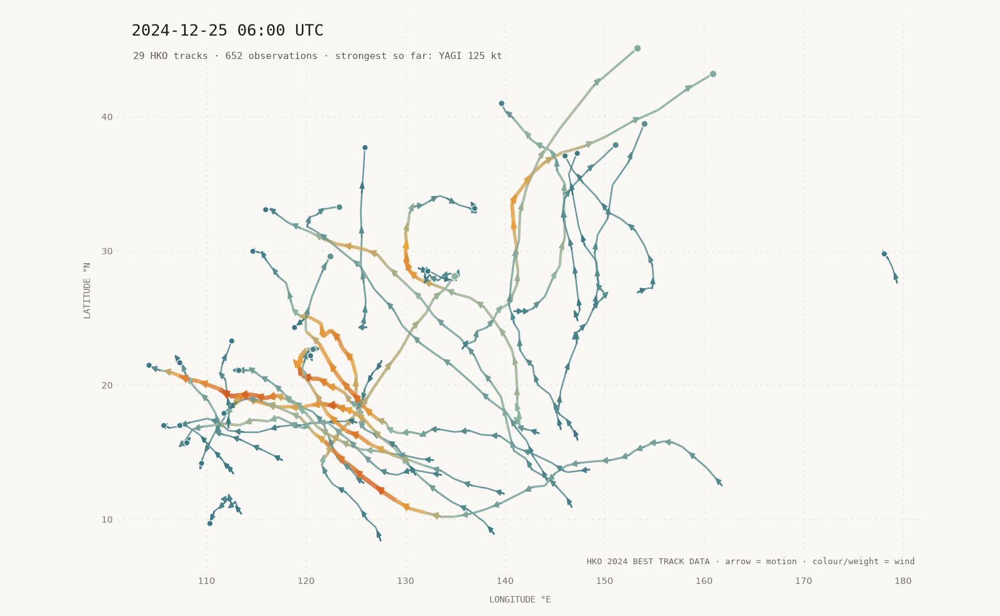
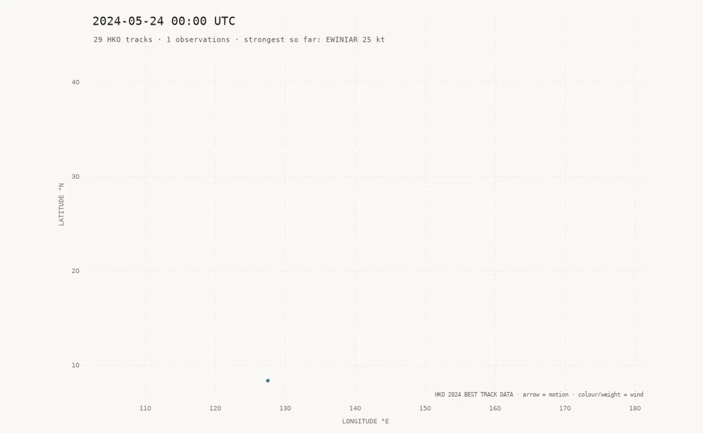
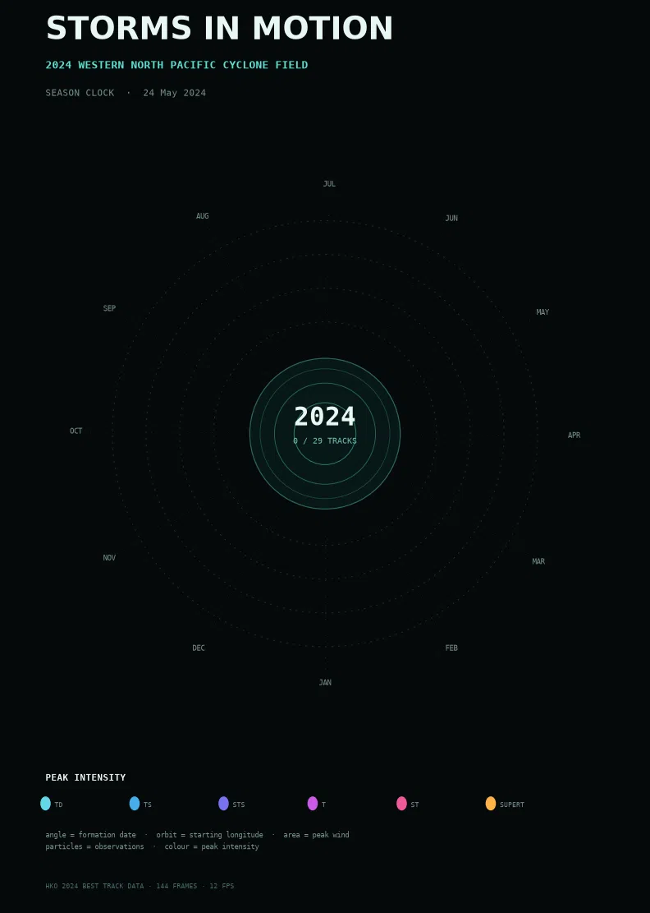

# Currents of the 2024 Typhoon Season

### The phenomenon

Tropical cyclones are moving systems of wind and low pressure. Their tracks curve across the western North Pacific and the South China Sea while their intensity grows and weakens. I chose this phenomenon because a conventional track map shows position well but often makes speed and intensity feel secondary. This visualisation treats every six-hour movement as a current-like arrow, so the season appears as a field of motion rather than a collection of isolated storm symbols.

### Data source

The raw data are the Hong Kong Observatory's **Tropical cyclone best track data (post analysis) for 2024**:

- [Dataset page on DATA.GOV.HK](https://data.gov.hk/en-data/dataset/hk-hko-rss-tropical-cyclone-best-track-data)
- [Original 2024 CSV file](https://data.weather.gov.hk/weatherAPI/hko_data/tc/HKO2024BST.csv)

The unchanged file is committed as `data/HKO2024BST.csv`. It contains **652 observation rows covering 29 HKO tracks**. Each row is one analysed cyclone position at a UTC time. It records the cyclone name and codes, latitude and longitude in 0.01 degrees, intensity category, estimated minimum central pressure in hPa, and estimated maximum surface wind in knots.

### The picture














The arrow direction shows how a cyclone moved between consecutive observations. Colour changes from teal to orange as maximum surface wind increases, while thicker strokes also indicate stronger wind. The animation reveals when each track entered the season and allows the paths to accumulate over time.

The picture deliberately hides coastlines, political borders, storm size, rainfall, damage and forecast uncertainty. It also samples the animation timeline to approximately one frame per eighteen hours, although every committed observation still contributes to the final tracks. The result is therefore a picture of **movement and intensity**, not a complete account of each cyclone's impacts.

### How to run

```bash
uv run plot_currents.py
```
